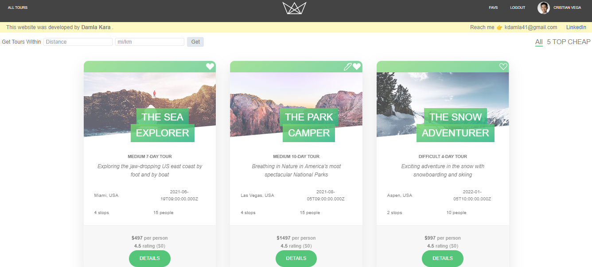
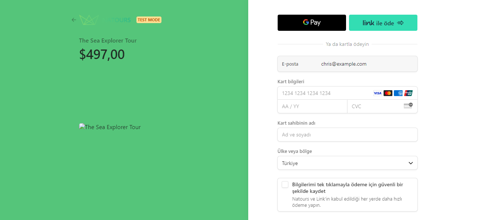
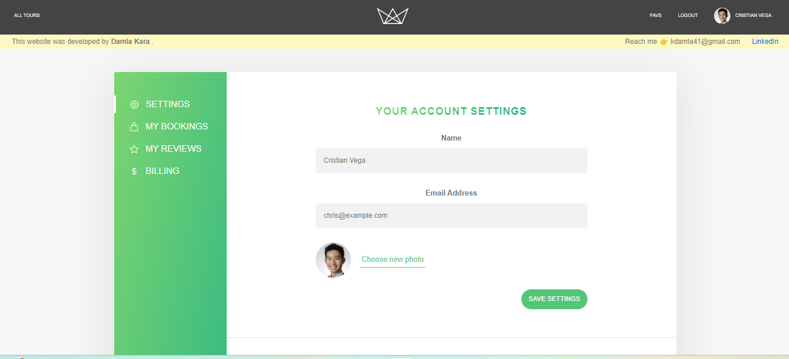

# Natours

"Natours" – a dynamic tour booking app designed to revolutionize the way we explore the world!

## Table of contents

- [Overview](#overview)
  - [The app](#the-app)
  - [Screenshot](#screenshot)
  - [Built with](#built-with)
  - [Used Features](#used-features)
- [Author](#author)

## Overview
Natours is not just another travel app. It's a comprehensive platform where users can effortlessly search, like, and book diverse tours. Integrated with Stripe for secure payments, it offers a seamless booking experience. Users can also curate their favorite tours, leave reviews, and engage with a vibrant community of travel enthusiasts.

### The app

Users should be able to:

- View the optimal layout depending on their device's screen size
- They can log in and log out
- They can sign up
- Users can be able to upload an avatar,change their name, email and password
- They can book tours with Stripe,
- They can add and remove tours from their favorites lists,
- They can view all the bookings they have made,
- They can leave a review and rating on the tours they have  booked,
- They can edit and delete their reviews,
- They can see their invoices and total amounts,
- They can see all the reviews given to tours by other users,
- They can filter tours with options such as Top 5 cheap tours or tours within x distance near me
- They can view the tours near them or anywhere they want on the map 

### Screenshot

### Built with

- React.JS
- React Query
- NodeJS
- Express
- MongoDB
- Mongoose
- Context API
- Stripe
- Tailwind CSS

### Used Features
- Rest API
- useState
- useEffect
- useRef
- localStorage
- useContext
- useMutation
- useNavigate
- useQueryClient
- useQuery
- createContext

## Author

- LinkedIn - [Damla Kara](https://www.linkedin.com/in/damla-kara-348081232/)
